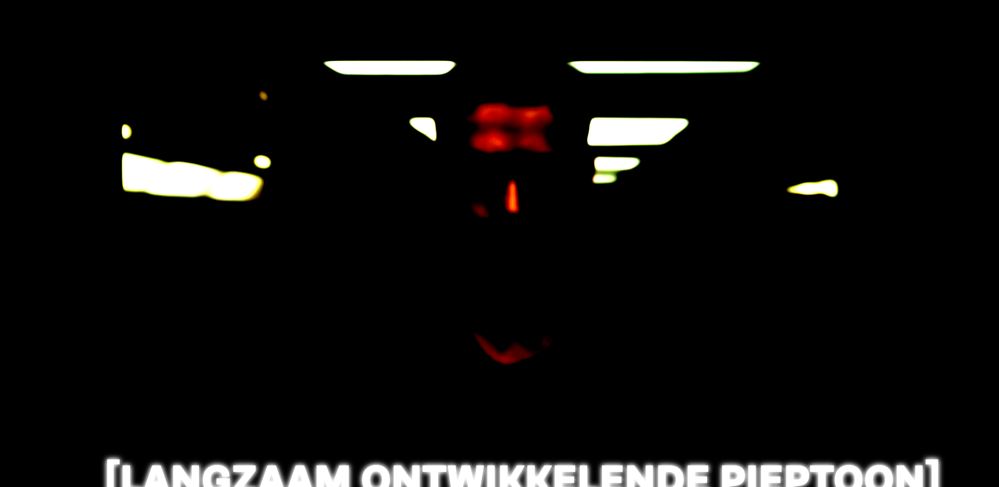
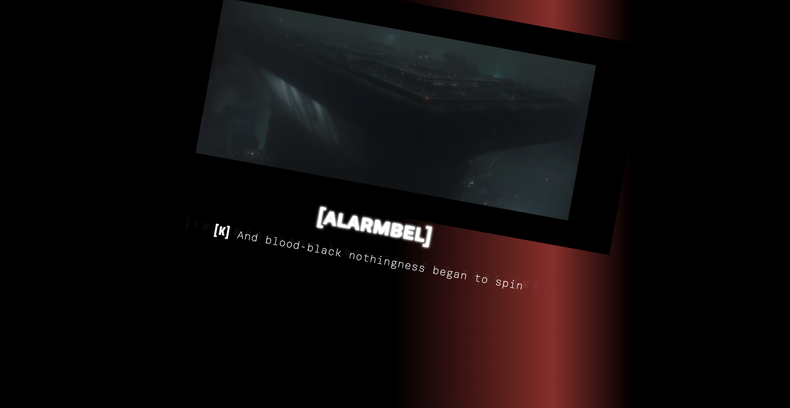
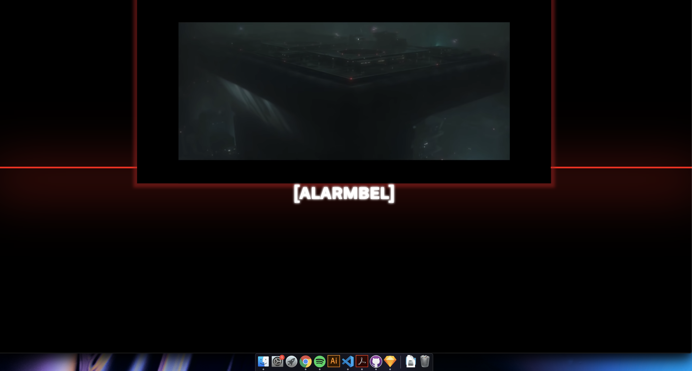
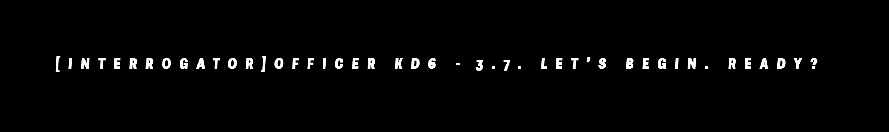

# Web Typografie - Blade Runner 2049 - Tim de Jong

## De Opdracht

Voor de opdracht Closed Captions, verkregen bij het vak Web Typografie, hebben we de taak gekregen video/film aantrekkelijk te maken voor mensen auditieve beperking. We zijn niet even wat persoonlijker gegaan en zijn middels Vasilis in contact gekomen met Darice. Darice heeft een auditieve beperking en heeft ons aanwijzingen gegeven en verteld wat zij fijn vindt bij het kijken van een film.

Film is naast beeld ook geluid. Het geluid maakt scenes spannend, verdrietig of juist vrolijk. Aan ons de taak om dit over te brengen middels tekst. Dit gaan we doen middels Closed Captions. Een type ondertiteling waarbij omgevingsgeluiden ook een  plek krijgen toegewezen zodat de film een extra dimensie krijgt. Deze geluiden kunnen hun eigen vormgeving, Look And Feel, en beleving krijgen om zo de film beter over te brengen op, in dit geval, Darice de Cuba.

## Opdrachtgever | situatie

Darice de Cuba is front-end developer uit Den Haag. Ze richt zich voornamelijk op Inclusive Design en geeft lezingen over dit onderwerp op bijvoorbeeld de Hogeschool van Den Haag. Ondanks dat Darice een auditieve beperking heeft spreekt ze vloeiend 3 talen en de basisbegrippen van gebarentaal. Ze heeft leren spreken in haar jeugd en is op latere leeftijd gaan leiden aan gehoorverlies aan beide oren. 

Aan het begin van de opdracht hebben we de kans gehad aantal vragen aan Darice te stellen om er achter te komen wat haar motivaties waren, de doelen die ze heeft bij deze opdracht en wat ze zich voorsteld aan het einde van de rit. 
Er kwam naar voren dat ze het belangrijk vindt dat:

* Stemmen duidelijk onderscheid hebben
* Omgevingsgeluid duidelijk gemaakt
* Kleurrijk maar leesbaar

## Product 

### Eerste versie

Ik had wat opstartproblemen het eerste deel van deze opdracht. Tijdens het eerste feedback moment had ik dus ook niet zo veel te laten zien. Ik heb de eerste week onderzocht welk font ik wilde gebruiken. We kregen de optie om te kiezen tussen het systeemfont, dit wil zeggen dat je het standaard font van je browser kiest. De andere keuze was Brenner. Brenner is een heel uitgebreid webfont.

Ik heb gekozen voor Brenner. Dit heb ik gedaan zodat ik meer variatie kan aanbrengen door de vorm van de letter alleen. Ik wilde de tekst niet te veel kleurvariatie geven en onderscheid tussen verschillende stemmen laten zien door de naam van de persoon in kwestie mee te geven. 

Ik had een begin gemaakt aan de visuele vormgeving van de eerste stem. Hiervoor heb ik een ‘glitch effect’ gebruikt. In de film is te zien dat de hoofdrolspeler in een ruimte zit en tegen een computer praat. Doordat dit een computer is waartegen gesproken wordt en omdat de stem in kwestie robotachtig klinkt leek mij de link tussen een ‘glitch effect’ en de stem vrij makkelijk gemaakt om dat gevoel over te brengen.

#### Feedback

Omdat ik weinig werk had verricht voor de eerste feedbackronde kreeg ik geen concrete feedback en waren het eerder tips die ik kreeg.

### Tweede versie
Ditmaal had ik motivatie gevonden en ben ik aan de slag gegaan met CSS. Ik ben gaan experimenteren met verschillende filters en keyframes om effecten te bereiken. Ik probeerde beetje over de top te gaan en te spelen met het fragment zelf. Op de achtergrond worden veel onheilspellende geluiden gespeeld. Dat is vrij lastig vorm te geven maar heb dit geprobeerd met een glitch achtig effect. Dit wilde ik doen omdat het t best bij de geluiden past en om het in lijn te trekken met de vormgeving van de teksten. Ik heb geprobeerd door met lasers, flitsende achtergronden en beweging van het iFrame iets neer te zetten dat zonder geluid toch aantrekkelijk is om naar te kijken.

#### Feedback
Tijdens het gesprek met Darice kreeg ik te horen dat de glitch tekst toch niet zo goed leesbaar was. Dit heb ik iets aangepast en er voor gezorgd dat het wat leesbaarder wordt.  In gesprek met vasilis kwam naar voren dat het contrast effect misschien te heftig was. Dit heb ik aangepast en verbeterd.

### derde versie (eind product)

Het uiteindelijke resultaat vind je hier. https://timdej0ng.github.io/web-typography-19-20/closed-captions/index.html
Na wat stoeien en knoeien met CSS heb ik naar eigen zeggen een mooi product neer gezet wat Darice helpt de film te beleven. Ik heb na de tweede feedback ronde nog enkele dingen aangepast en toegevoegd zoals naamgeving van de achtergrondgeluiden en de vormgeving van de filters op het Iframe.

